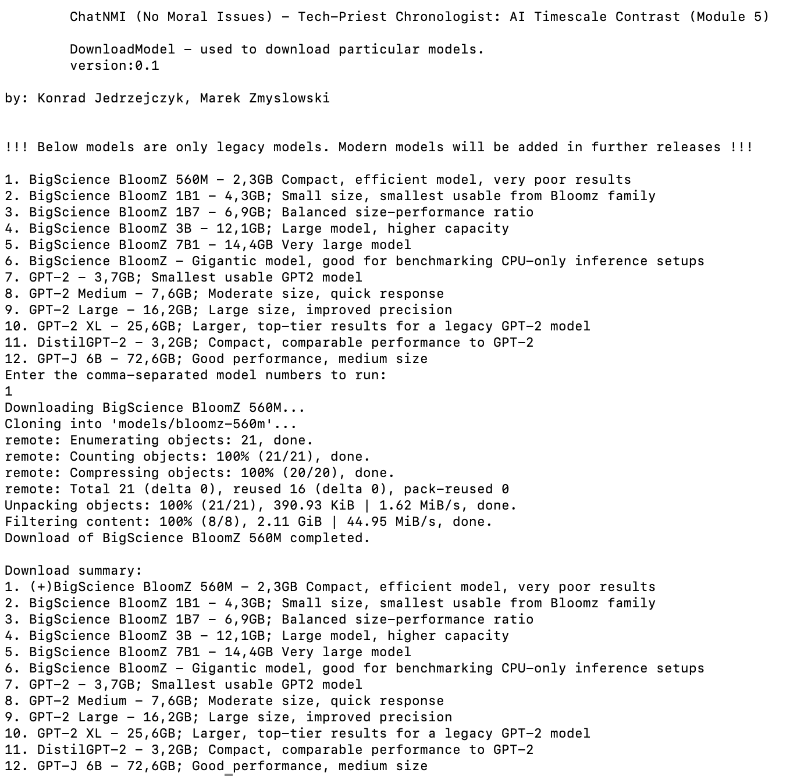
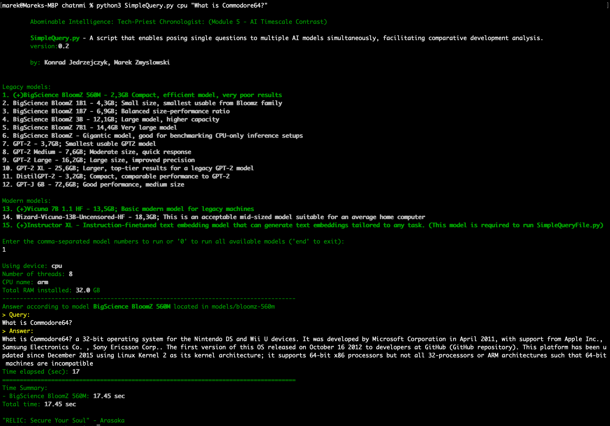
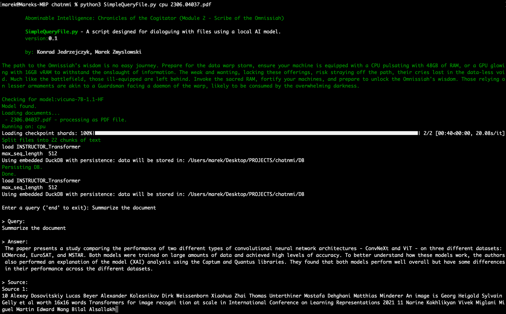
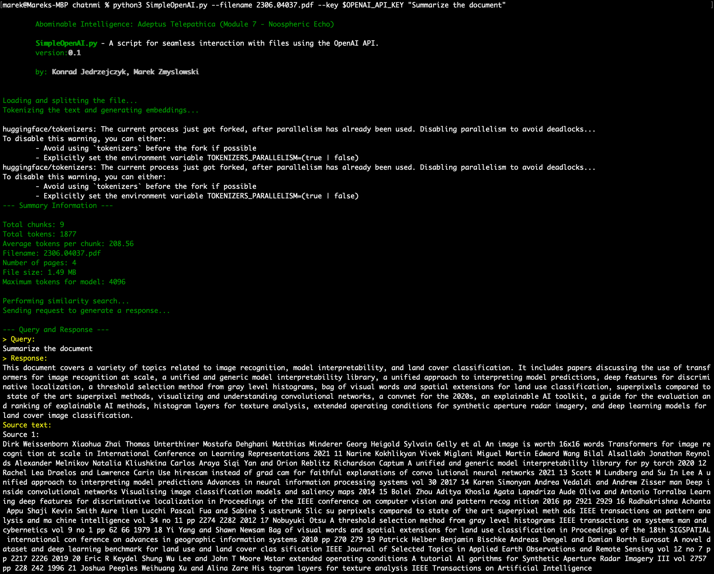

# ChatNMI (No Moral Issues) - AI Modules: Release 0.2 Update

## Introduction
ChatNMI forms part of a larger project, focused on the creation of an open-source, homebrew application that is easily accessible and usable by anyone. Transparency is our watchword; thus, we aim to unveil our entire codebase and demonstrate how this system can be effectively built on your own local infrastructure.
In the release 0.2 update, we're proud to announce the incorporation of modern AI models, specifically Vicunia 7B and 13B. Among them, the 13B model, which we highly recommend, operates without censorship. We've also upgraded the **DownloadModels.py** script to ensure full compatibility with all other scripts in this module.

## Components
- **SimpleQueryFile.py** - Abominable Intelligence: Chronicles of the Cogitator (Module 2 - Scribe of the Omnissiah). A script designed for dialoguing with files using a local AI model.
- **SimpleOpenAI.py** - Abominable Intelligence: Adeptus Telepathica (Module 7 - Noospheric Echo). A script for seamless interaction with files using the OpenAI API.
- **DownloadModels.py** - Abominable Intelligence: Machine Cult Adept (Module 3 - Adeptus Administratum). This script provides an effortless download process for AI models.
- **SimpleQuery.py** - Abominable Intelligence: Tech-Priest Chronologist: (Module 5 - AI Timescale Contrast). A script that enables posing single questions to multiple AI models simultaneously, facilitating comparative development analysis.

## Descriptions
- **SimpleQueryFile.py**: This script utilizes two AI models to deliver responses derived from vast quantities of text across multiple large documents (.txt, .pdf, and .csv). One model prepares the vector base, while another processes the response. Although it requires a computer with a minimum of 48GB RAM for the 7B model and 64GB RAM for the uncensored 13B model, the high-quality responses justify the hardware. Optimally, a graphics card with 24GB vRam should support these models, but it's not a necessity. The script supports multiple local files at once and refreshes the base after each use.
- **SimpleOpenAI.py**: This script eliminates the token limitation issue inherent in the OpenAI API. Optimized for rapid response delivery, it provides answers to inquiries about single documents in .txt or .pdf formats within seconds. Please note, an OpenAI API key (credits) is required for the script's functionality.
- **SimpleQuery.py**: This script serves a unique function by allowing you to pose identical questions to multiple AI models simultaneously for a comprehensive comparative development analysis. Utilizing this script, you can select from a variety of models (which you can download using the DownloadModels.py script) ranging from the yet-to-be-finished-in-training Bloom model, through various versions of legacy GPT, to modern models like Vicunia 7B and 13B. This functionality allows you to directly compare and evaluate the improvements and changes in response quality over time and across different models, enhancing your understanding of the evolution and progression of AI technology.

## Installation
To use ChatNMI, ensure you've installed the necessary dependencies on your system:

    sudo apt-get install git, git-lfs
    sudo apt install python3-pip
    cat requirements.txt | xargs -n 1 pip install

## Running
### Model Download

        python3 DownloadModels.py

### SimpleQuery

        python3 SimpleQuery.py cpu "What is Commodore64?"
 

### SimpleQueryFile

        python3 SimpleQueryFile.py cpu 2306.04037.pdf

### SimpleOpenAI

        python3 SimpleOpenAI.py --filename 230604037.pdf --key OPENAI_API_KEY "Summarize the document" 
 
 
## Future Releases
Looking ahead, we already have plans to integrate an even more diverse range of AI models into our portfolio, including those specifically crafted for developers. This upcoming release will further enhance our architectural capabilities, allowing users to compare and contrast outputs from a broader spectrum of AI models, enriching their understanding of AI's potential and capabilities.
 
Moreover, we've made significant strides towards improving support for non-Latin scripts, such as Cyrillic. Designed with discretion and user convenience at its core, this subtle enhancement broadens the versatility of our tools and enables seamless interaction, irrespective of differences between the source documents and the user's preferred communication language.
 
Rest assured, these advancements are already within our grasp and will be released to the public when we deem the timing is just right.
 
Stay tuned for these exciting updates and more, as we forge ahead in our mission to elevate both transparency and functionality in AI technologies. We're thrilled to guide you into the future of AI, and we appreciate your continued support on this transformative journey.

## Contact
<chatnmi@outlook.com>
