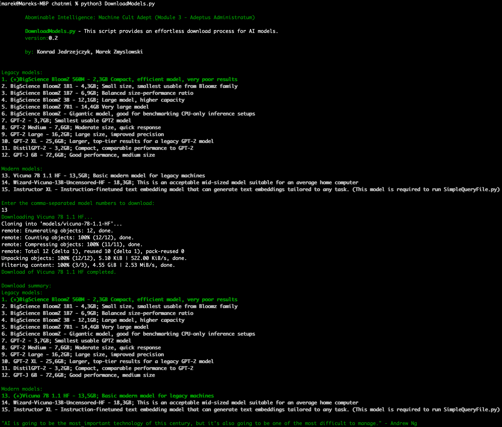

# ChatNMI (No Moral Issues) - Tech-Priest Chronologist: AI Timescale Contrast (Module 5)

ChatNMI is a part of a broader project, the first module of many we plan to release. It's primarily aimed at developing an open-source, homebrew application that anyone can install and use.

Why open-source? We champion transparency and have plans to unveil the entire codebase. 
Why homebrew? Our goal is to illustrate how this system can be built locally, leveraging your own infrastructure. 
Why NMI? This module doesn't employ any politically correct text parsing algorithms - it facilitates the use of uncensored AI models, thereby delivering the exact output you inquire.

## First Release

The initial release of Module 5 supports only older AI models, providing a contrast to the models currently available. This release includes two scripts: SimpleQuery.py, which is designed to test responses from different AI models and supports both CPU and GPU for inference, and DownloadModels.py, a script used for downloading these models. Currently, only models that can be utilized by SimpleQuery are available for download.

## Future Releases

In upcoming versions of this module, we plan to incorporate support for newer, more sophisticated AI models with diverse architectures. This addition will enable users to compare and contrast outputs from various generations and styles of AI models, offering a broader view of AI capabilities.

### Installation

    sudo apt install git git-lfs
    pip install -r requirements.txt

### Running
#### Model Download

        python3 DownloadModels.py

### Simple Query

        python3 SimpleQuery.pl gpu "What is Commodore64?"

### Contact
<chatnmi@outlook.com>
